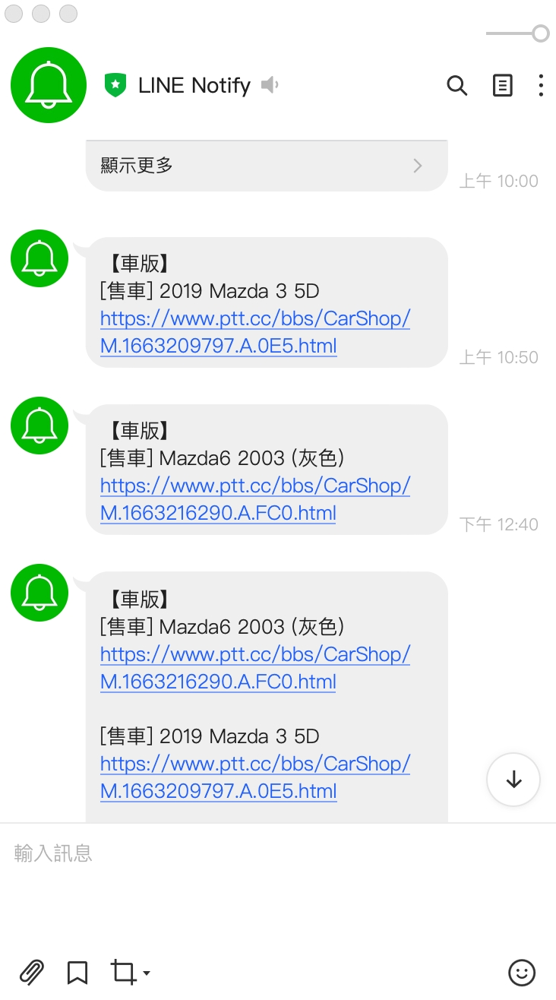

# PTT subscribe

訂閱 PTT CarShop 最新發文。<br/>
簡化瀏覽流程，直接發送新的文章連結到 line。

## 示意圖

<p align="center">

</p>

## 如何使用
    
申請 Line token

[Line Notify 申請 token](https://notify-bot.line.me/doc/en/)

設置環境變數

    $ cp .env.example .env

建立及部署

    $ ./run.sh local

    預設映像檔名稱: `local/ptt_sub:latest`

## 架構

```shell
.
├── build
│   ├── build.sh
│   ├── crontab             # 執行 module 的 crontab
│   └── Dockerfile
├── deploy               
│   ├── deploy.sh           
│   └── publish.sh          # 在遠端機器部署的 script
├── .env                    
├── subscribe.py            # 主要 module
├── boot.sh                 # 啟動 cron 的 入口 script
├── compose.yml
└── run.sh                  # 執行 build and deploy 的 script
```

## 其他
[筆記](https://github.com/HMS24/pttsub/blob/master/assets/note.md)
