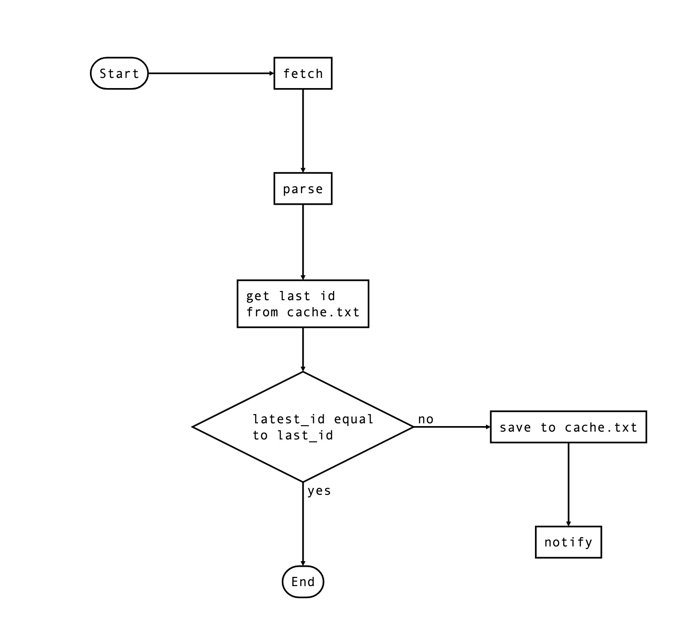

# 一些筆記及想法

## Ｗhy container？

對於執行 module 可以
1. 我的電腦 mac os 直接運行 cronjob
2. 遠端機器 git pull 操作
3. 打包成 image，遠端 run container

使用 `1` 的方式可以導出 log 到 file 或者從 mail 追蹤 `/var/mail/$USER` cronjob 的 log。
e.g. 將 `crontab` 改成 `*/10 * * * * python3 subscribe.py >> /tmp/cron_log.txt`。
執行 `crontab crontab` 即可。但似乎不太方便，筆電會關機...

`2` 則是在遠端機器上操作，除了 repo 的套件安裝需要手動外，另外像是機器也會需要安裝額外 packages(e.g. git, pipenv 之類)。
還有 git 的 權限，也是個問題。如果遇到 code 更新節奏快或 packages 需要調整就會相對麻煩。

`3` 比較簡單，版本管控也比較單純。但 cron 是屬於系統服務，需要以 root 身份執行，感覺安全性很不足。
另外就是原本的環境變數都不會 load into cronjob，有點 tricky。

最後選擇 `3`，提高開發的效率。

## Ｗhy crontab？

對於排程可以
1. Cron
2. APscheduler
3. Airflow
4. AWS Lambda 設定 event 及 rate

`1` 只有一支 cronjob 要跑且蠻簡單的，較符合需求。但規模開始增加時不好管理。

`2` 需要再 install package，增加套件相依性及管理上的成本(e.g. code, package version)。

`3` 架設 airflow server 以 configuration as code 建造 ETL。看了一下有蠻多功能，可以 task 重跑也可以將 task 組合成不一樣的 ETL 流程，但似乎用不太到，反而得增加維護成本，讓整體開發效率下降...暫不考慮。

`4` 以 cloud 的方式相對不熟。

先以 `1` 快速開發。

## Cheat sheet

    $ crontab -l  列出 cronjobs
    $ crontab -e  編輯
    $ crontab -r  清除所有

## 草稿

- fetch
    - source: 
        取得 ptt CarShop 版的**售車**標題網頁
        https://www.ptt.cc/bbs/CarShop/search?page=1&q=%E5%94%AE%E8%BB%8A
    - package:
        `requests` or `requests-html` ?
        use `requests-html` 對 `requests` 的額外包裝也包含了 `pyquery`
        直接定位元素不需要額外 `beautiful or pyquery`
- parse
    解析網頁取得
        - 標題
        - 單頁 url(https://www.ptt.cc/bbs/CarShop/M.1663018172.A.93C.html)
            從 單頁 partition **M.1663018172.A.93C** as identifier
- compare
    - cache 中取得上ㄧ次 fetch 的最新資訊(標題、作者、日期)
    - 與剛剛解析後得到的 list 比較，**先假設沒有刪文**
        e.g.
        - 第一種: 正常狀況
        ```python
            parsed = [a, b, c, d, e]
            newest_in_cache = c

            c_index = parsed.index(c)
            new_publish = parsed[:c_index]
        ```
        - 第二種: 10 分鐘內新售車文超過 20 筆(每頁 20 筆)
            半小時的時間要大量新增售車文，不太常見。略過
            如果不幸發生:
                 - 縮短 cron job 間隔時間
                 - 一次 parsed 2 頁
- storage
    將目前比對的最新存在 cache.txt
    `(identifier, title, single_page_url)`
- schedule
    間隔時間: 半小時
    - packages
        `apschedule` or 單純使用 `linux crontab` ?
        先使用 `linux crontab` 相對單純不需要再裝 package。
- notify
    - mail or line notify
        ~~mail builtin `smtplib` 應該比較容易，line notify 需要花點時間研究 line developer，先選 mail。~~
        use line notify
        `resp.headers["X-RateLimit-Remaining"] 看剩下的 limit count, default 1000 per hour`
- deploy
    - build docker image
    - run on ec2

## 關於 modules

- `boot.sh`: 執行 cron 的 script，使之在前景(foreground)執行。
- `subscribe.py`: 小規模放在一個 module 裡，若未來還有其他需要訂閱的看板，則需要把 `fetch, parse` 等函式功能拆開。
- build
    - `build.sh`: 使用 docker cli plugin 可以指定特定 platform (linux/amd64)，與要部署的遠端機器 OS 一致，減少出錯。
    - `crontab`: crontab 指令，並將 log 導向 stdout 及 stderr。

## 關於流程

### 流程圖 - `subscribe.py`

<p align="center">

</p>

### 流程說明 - `subscribe.py`

    - fetch
    - parse
    - 從 cache.txt 取得上次最新文章的 id
    - 與 fetched 的最新文章比較
        - 相同 return
        - 不同
            - save 最新文章 id
            - 切割 fetched[ 0:上一次紀錄的最新文章 index ]
            - Line 通知

### 流程說明 - `run.sh`

    - build
        - 安裝 packages
        - 設定 crontab and run
    - push
        - 推到 docker hub
    - deploy
        - 傳送 compose.yml、publish.sh 及相關 variables
    - publish
        - pull image
        - run container


## 關於 TODO

- 過濾廠牌及預算，甚至是推文數及推噓等資訊。
- 訂閱其他看板

## 關於問題

- 環境變數讀取不到
    > cron doesn't load your `bashrc` or `bash_profile` so any environment variables defined there are unavailable in your cron jobs

    另外進到 running container 裡面從 `/etc/init.d/cron` 設定檔看到某段
    
    ```shell
        parse_environment ()
        {
            for ENV_FILE in /etc/environment /etc/default/locale; do
                [ -r "$ENV_FILE" ] || continue
                [ -s "$ENV_FILE" ] || continue
        ...
        以下省略
    ```
    可以清楚看到 cronjob 啟動時會 load `/etc/environment`。
    因此在 `boot.sh` 將環境變數導入 `printenv > /etc/environment`。
    但安全性相當差，其他 user 或 service 可能會共用該份檔案，不過這是最快的解決方式了。[reference](https://stackoverflow.com/questions/2229825/where-can-i-set-environment-variables-that-crontab-will-use)

## 參考資源

- [Cron job troubleshooting guide](https://cronitor.io/cron-reference/cron-troubleshooting-guide)